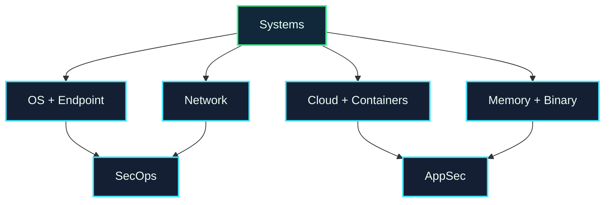

# Systems & Infrastructure Security Map

Systems security protects the platforms that software depends on: operating systems, networks, cloud, containers, identity systems, endpoints, and low-level memory behavior.

## Choose a Subarea

| Subarea | What it studies | Open |
| --- | --- | --- |
| Operating System & Endpoint Security | users, permissions, processes, logs, hardening | [[Operating_System_Endpoint_Security]] |
| Network Security | segmentation, firewalls, DNS, routing, wireless, VPNs | [[Network_Security]] |
| Cloud & Container Security | cloud IAM, storage, Kubernetes, Docker, secrets | [[Cloud_Container_Security]] |
| Memory & Binary Security | memory corruption, exploitation, reverse engineering, mitigations | [[Memory_Binary_Security]] |

## Local UVT Questions

* Which courses cover operating systems, networks, distributed systems, cloud, or low-level programming?
* Who supervises Linux, networking, cloud, or performance/security projects?
* Can a student do a lab project around hardening, logs, or secure infrastructure?

## Fast External Links

* [CIS Controls](https://www.cisecurity.org/controls)
* [CISA Known Exploited Vulnerabilities Catalog](https://www.cisa.gov/known-exploited-vulnerabilities-catalog)
* [MITRE ATT&CK Enterprise Matrix](https://attack.mitre.org/matrices/enterprise/)
