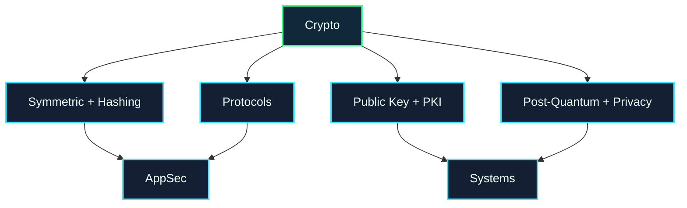

# Cryptography Map

Cryptography provides the trust primitives used by the rest of security: secrecy, integrity, authentication, signatures, key exchange, and privacy-preserving protocols.

## Choose a Subarea

| Subarea | What it studies | Open |
| --- | --- | --- |
| Symmetric Crypto & Hashing | hashes, MACs, block ciphers, password hashing | [[Symmetric_Crypto_Hashing]] |
| Public-Key Crypto & PKI | RSA, ECC, certificates, digital signatures, TLS identity | [[Public_Key_Crypto_PKI]] |
| Protocols & Applied Crypto | TLS, secure messaging, key management, implementation mistakes | [[Protocols_Applied_Crypto]] |
| Post-Quantum & Privacy Crypto | lattice crypto, ZK proofs, private computation, migration | [[Post_Quantum_Privacy_Crypto]] |

## Local UVT Questions

* Which math, algorithms, cryptography, or blockchain courses connect to security?
* Who supervises crypto, privacy, blockchain, or protocol projects?
* Can a student build a small demo around hashing, signatures, certificates, or post-quantum migration?

## Fast External Links

* [A Graduate Course in Applied Cryptography](https://toc.cryptobook.us/)
* [NIST Post-Quantum Cryptography](https://csrc.nist.gov/projects/post-quantum-cryptography)
* [Crypto 101](https://www.crypto101.io/)
