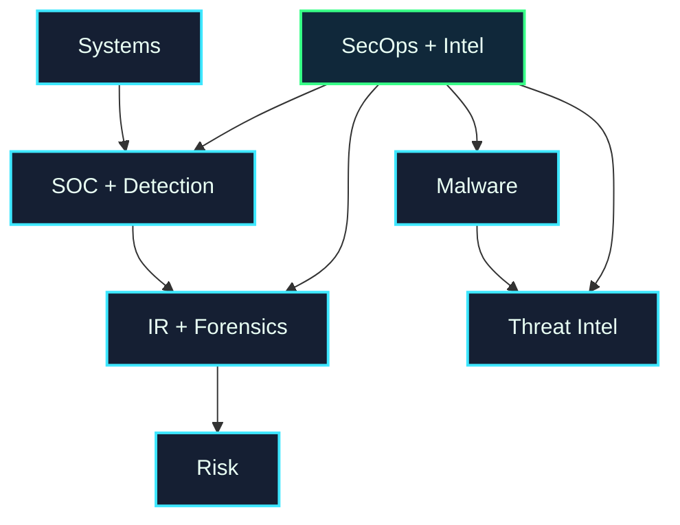

# Security Operations & Threat Intelligence Map

Security operations detects, investigates, and responds to suspicious activity. Threat intelligence studies attackers, campaigns, tools, tactics, and real-world risk.

## Choose a Subarea

| Subarea | What it studies | Open |
| --- | --- | --- |
| SOC Monitoring & Detection | alerts, SIEM, logs, detection engineering, triage | [[SOC_Monitoring_Detection]] |
| Incident Response & Forensics | containment, evidence, timelines, recovery, lessons learned | [[Incident_Response_Forensics]] |
| Malware Analysis | malicious files, behavior, reverse engineering, sandboxes | [[Malware_Analysis]] |
| Threat Intelligence | attacker tactics, reports, indicators, MITRE ATT&CK mapping | [[Threat_Intelligence]] |

## Local UVT Questions

* Which courses cover networks, operating systems, logs, data analysis, AI, or distributed systems?
* Who can help with lab logs, system administration, or data analysis?
* Is there a local CTF, blue-team event, company guest talk, or incident-response workshop?

## Fast External Links

* [MITRE ATT&CK](https://attack.mitre.org/)
* [CISA Cybersecurity Advisories](https://www.cisa.gov/news-events/cybersecurity-advisories)
* [SANS DFIR resources](https://www.sans.org/white-papers/)
