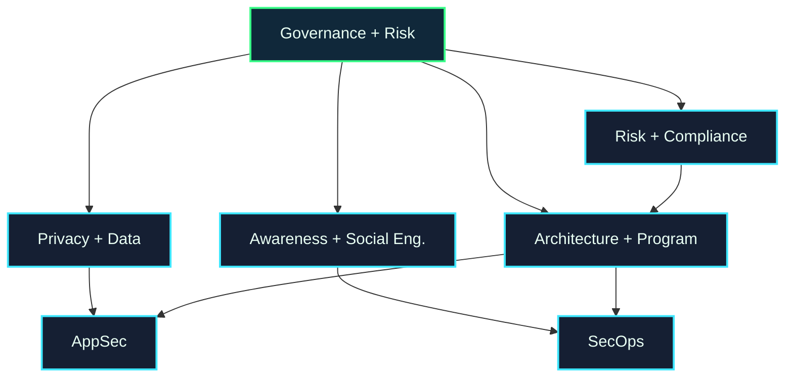

# Governance, Risk & Human Security Map

Governance connects technical security to organizations, people, policies, law, privacy, and decisions about what matters most.

## Choose a Subarea

| Subarea | What it studies | Open |
| --- | --- | --- |
| Risk Management & Compliance | risk assessment, controls, standards, audits, accountability | [[Risk_Management_Compliance]] |
| Privacy & Data Protection | personal data, privacy engineering, GDPR-style obligations | [[Privacy_Data_Protection]] |
| Security Awareness & Social Engineering | phishing, training, behavior, human-centered attacks | [[Security_Awareness_Social_Engineering]] |
| Security Architecture & Program Management | strategy, policies, roadmaps, ownership, maturity | [[Security_Architecture_Program_Management]] |

## Local UVT Questions

* Which courses cover ethics, privacy, law, project management, software process, or organizational systems?
* Who can advise on responsible disclosure, research ethics, or privacy-sensitive projects?
* Are there university policies or local events related to privacy, security, or responsible technology?

## Fast External Links

* [NIST Cybersecurity Framework](https://www.nist.gov/cyberframework)
* [NIST Risk Management Framework](https://csrc.nist.gov/projects/risk-management)
* [SOUPS](https://www.usenix.org/conferences/byname/884)
