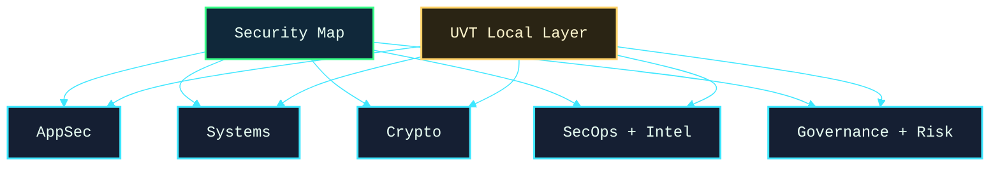

# Security: A Nested Map for Computer Science

> Security is too large to understand as one flat list. This map works like a game world: choose a main area, enter its local map, then choose a subarea for the detailed information.

The project is organized in three levels:

1. **Main map:** choose one of five major cybersecurity areas.
2. **Area map:** choose a subarea inside that area.
3. **Subarea page:** read activities, connections, problems, people, venues, and UVT/local actions.

## Choose a Main Area

| Main area | What it covers | Enter the map |
| --- | --- | --- |
| Application & Software Security | Web, APIs, secure coding, DevSecOps, software supply chain | [[Application_Software_Security_Map]] |
| Systems & Infrastructure Security | OS, networks, cloud, containers, memory, endpoint security | [[Systems_Infrastructure_Security_Map]] |
| Cryptography | Encryption, hashing, signatures, protocols, privacy, post-quantum crypto | [[Cryptography_Map]] |
| Security Operations & Threat Intelligence | SOC, incident response, malware, forensics, threat intel | [[Security_Operations_Threat_Intelligence_Map]] |
| Governance, Risk & Human Security | Policy, risk, compliance, privacy, awareness, usable security | [[Governance_Risk_Human_Security_Map]] |

## Global Structure

## How To Use This Map

* Start with the area that matches your interest.
* Open its area map and choose one subarea.
* Read the subarea page and pick one small project or local contact.
* Use the external links for deeper reading instead of making this vault too large.
* Fill in UVT placeholders such as `[ADD PROFESSOR EMAIL]`, `[ADD COURSE NAME]`, and `[ADD LOCAL EVENT]`.

## Local Dimension

The local UVT layer is here: [[UVT_CS_Security_Landscape]]. It connects the global security areas to courses, professors, labs, project ideas, and events at the Department of Computer Science @ UVT.

## External Starting Points

* [StationX overview of cybersecurity domains](https://www.stationx.net/cyber-security-domains/) - broad domain map.
* [OWASP projects](https://owasp.org/projects/) - application security.
* [MITRE ATT&CK](https://attack.mitre.org/) - attacker behavior and operations.
* [NIST Cybersecurity Framework](https://www.nist.gov/cyberframework) - governance and risk.
* [CISA Known Exploited Vulnerabilities Catalog](https://www.cisa.gov/known-exploited-vulnerabilities-catalog) - real exploited vulnerabilities.
