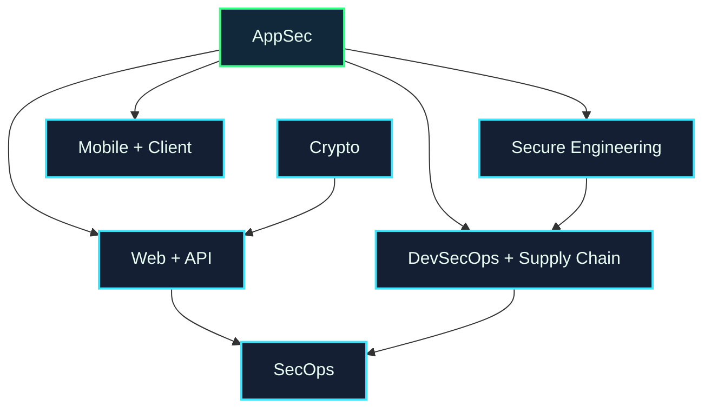

# Application & Software Security Map

Application security focuses on software people directly use: web apps, APIs, mobile apps, backend services, and the code/dependencies used to build them.

## Choose a Subarea

| Subarea | What it studies | Open |
| --- | --- | --- |
| Web & API Security | Authentication, authorization, sessions, injection, business logic | [[Web_API_Security]] |
| Secure Software Engineering | Secure design, code review, testing, threat modeling | [[Secure_Software_Engineering]] |
| DevSecOps & Supply Chain | CI/CD, dependencies, secrets, build systems, SBOMs | [[DevSecOps_Supply_Chain_Security]] |
| Mobile & Client Security | Mobile apps, browsers, desktop clients, local storage | [[Mobile_Client_Security]] |

## Local UVT Questions

* Which courses cover web, databases, software engineering, or testing?
* Who supervises secure coding, app testing, or software engineering projects?
* Is there a local hackathon, CTF, or student group where an AppSec project could be presented?

## Fast External Links

* [OWASP Top 10](https://owasp.org/www-project-top-ten/)
* [OWASP Web Security Testing Guide](https://owasp.org/www-project-web-security-testing-guide/)
* [PortSwigger Web Security Academy](https://portswigger.net/web-security)
